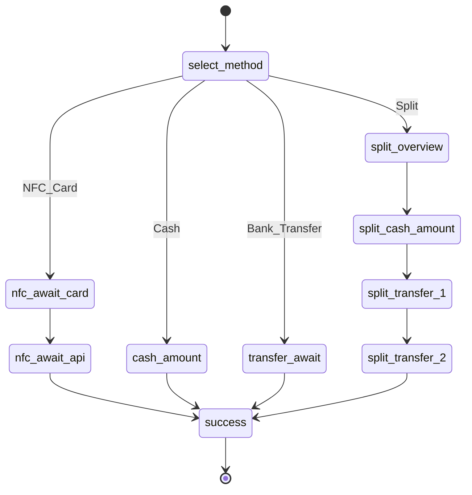
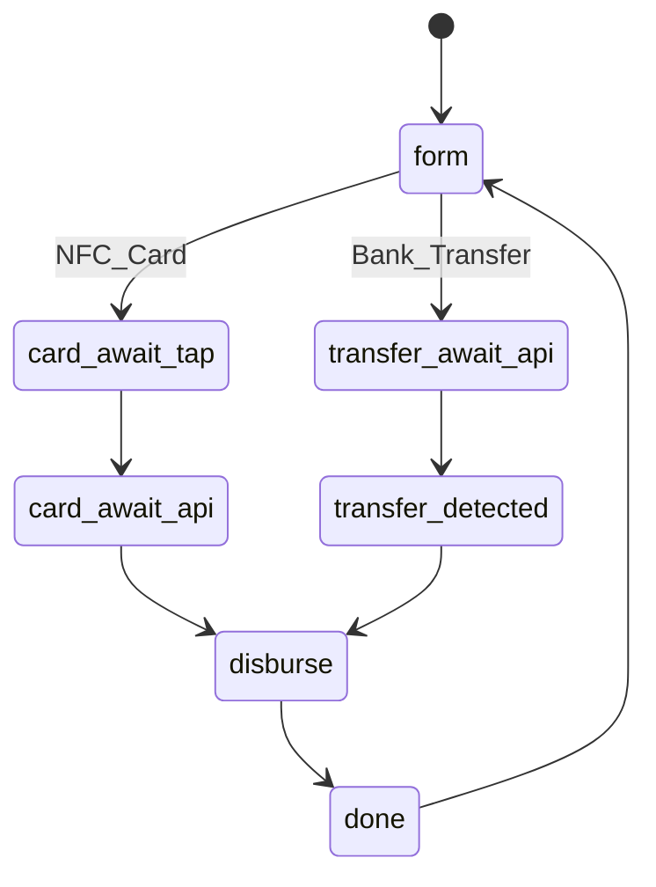
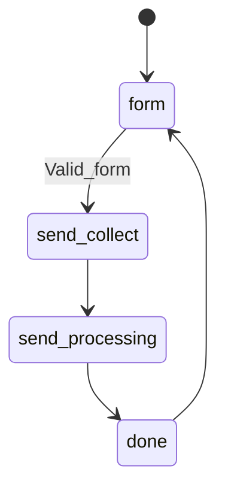

# Payment & cash-point flows

## Terminal payment (TerminalPayModal)

Split ratios: 40% cash, 30% transfer, 30% transfer (see `usePaymentFlow.ts`).

## Cash Point — Digital → Cash

Fee: 5% retained (`CASH_DISBURSEMENT_FEE_RATE`). Cash tender = payment × 95%.

## Cash Point — Collect cash → Send to bank

Required fields: sender name, cash amount, destination bank, account number, account name.

## Post-payment (checkout)

On terminal success: inventory decrement, terminal audit update, transaction log, navigate to `checkout` tab.
