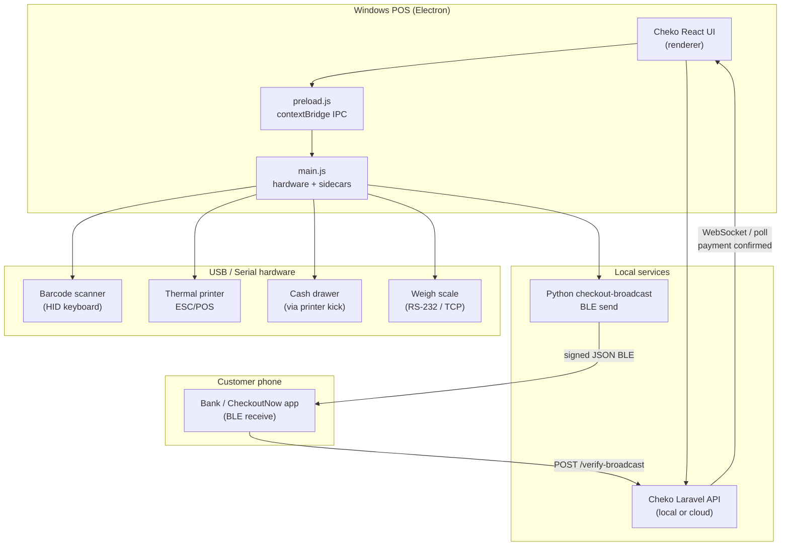

# Cheko — Full-Stack Windows POS Build Guide

**Document version:** 2026-07-30  
**Audience:** Backend developers, desktop engineers, and implementers  
**Related docs:** [BACKEND_HANDOFF.md](./BACKEND_HANDOFF.md) · [API_STUBS.md](./API_STUBS.md) · [Checkout Broadcast protocol](https://github.com/amithyone/checkout_broadcast)

---

## 1. Executive summary

Cheko today is a **UI-complete React POS demo** served as a static SPA at [cheko.check-outnow.com](https://cheko.check-outnow.com). All data is in-memory mock; API stubs throw `"Not implemented"`.

This guide describes how to **fuse the frontend with a real backend**, package it as a **Windows desktop POS**, connect **retail hardware** (scanner, receipt printer, cash drawer, weigh scale), and add **Checkout Broadcast** so customers can pay by bank transfer from their phone without typing account details.

It also defines **restaurant** and **supermarket** feature priorities so the product stays useful for real Nigerian businesses—not just a generic demo.

| Deliverable | Technology | Status |
|-------------|------------|--------|
| Web POS UI | React 19 + Vite 6 + Tailwind 4 | ✅ Done (demo) |
| Backend API | Laravel (recommended) | 🔲 To build |
| Windows desktop | Electron 33+ | 🔲 To build |
| Barcode scanner | USB HID (keyboard wedge) | 🔲 Electron main process |
| Receipt printer | ESC/POS thermal 58/80mm | 🔲 `electron-pos-printer` or raw ESC/POS |
| Cash drawer | Kick via printer RJ11 | 🔲 Open on cash payment only |
| Weigh scale | Serial / TCP / OPOS | 🔲 Deli & produce lanes |
| BLE bank pay | [checkout_broadcast](https://github.com/amithyone/checkout_broadcast) | 🔲 Python sidecar + API verify |

---

## 2. Target architecture



### Why Electron + separate backend?

| Choice | Reason |
|--------|--------|
| **Electron shell** | Same Cheko React UI; access to Windows printers, serial ports, and local processes |
| **Laravel API** | Matches existing Checkout stack; Sanctum auth; webhooks for bank transfers |
| **Python BLE sidecar** | [checkout_broadcast POS guide](https://github.com/amithyone/checkout_broadcast/blob/main/docs/pos-app-integration.md) recommends Python SDK for Windows BLE **send** role |
| **IPC bridge** | Renderer never touches hardware directly—main process validates and executes |

---

## 3. Fusing backend and frontend

### 3.1 Environment variables

**Web / Vite (`.env`):**

```env
VITE_API_BASE_URL=https://api.cheko.check-outnow.com/api/v1
VITE_BROADCAST_BRIDGE_URL=http://127.0.0.1:8765
VITE_HARDWARE_BRIDGE=electron
```

**Electron main (`.env` or Windows Credential Manager):**

```env
CHEKO_TERMINAL_ID=POS-LAG-001
CHEKO_SIGNING_KEY=<from bank terminal registration>
CHEKO_PRINTER_NAME=XP-80C
CHEKO_SCALE_PORT=COM3
CHEKO_BROADCAST_PYTHON=.venv/Scripts/python.exe
```

### 3.2 Shared API client (create once)

Add `src/shared/api/client.ts`:

```typescript
const BASE = import.meta.env.VITE_API_BASE_URL ?? "/api/v1";

export async function apiFetch<T>(
  path: string,
  opts: RequestInit & { token?: string } = {}
): Promise<T> {
  const headers: Record<string, string> = {
    "Content-Type": "application/json",
    Accept: "application/json",
    ...(opts.headers as Record<string, string>),
  };
  if (opts.token) headers.Authorization = `Bearer ${opts.token}`;

  const res = await fetch(`${BASE.replace(/\/$/, "")}/${path.replace(/^\//, "")}`, {
    ...opts,
    headers,
  });
  const body = await res.json().catch(() => ({}));
  if (!res.ok) throw new Error(body.message ?? `HTTP ${res.status}`);
  return body.data ?? body;
}
```

Replace each `throw new Error("Not implemented")` in `src/features/*/api.ts` with `apiFetch()` calls. Full endpoint list: [API_STUBS.md](./API_STUBS.md) and [BACKEND_HANDOFF.md §8](./BACKEND_HANDOFF.md#8-api-specification).

### 3.3 Integration order

| Phase | Backend routes | Frontend hooks to wire |
|-------|----------------|------------------------|
| 1 | `POST /auth/login`, `GET /auth/me` | `LoginPage`, session in `AppShell` |
| 2 | `GET/POST /catalog/*` | `useCatalog`, `InventoryPage` |
| 3 | `POST /sales`, `GET /transactions` | `AppShell.handlePaymentSuccess`, `useTerminalAudits` |
| 4 | Terminal + broadcast | `TerminalPayModal`, new `useBroadcastPay` |
| 5 | Hardware IPC | `window.chekoHardware.*` from Electron preload |
| 6 | Cash point, orders, hotel, flights | Remaining feature modules |

### 3.4 Backend repo layout (recommended)

```
cheko-api/                          # New Laravel app
├── app/
│   Http/Controllers/Api/V1/
│   │   AuthController.php
│   │   CatalogController.php
│   │   SaleController.php
│   │   TerminalController.php
│   │   BroadcastVerifyController.php   # POST /verify-broadcast
│   Models/
│   │   Terminal.php, Product.php, Sale.php, SaleLine.php
│   Services/
│   │   BroadcastVerificationService.php
├── routes/api.php
└── database/migrations/
```

**Suggested API host:** `https://api.cheko.check-outnow.com`  
**Auth:** Laravel Sanctum bearer tokens (same pattern as CheckoutNow consumer API).

### 3.5 Real-time payment confirmation

Bank transfer + broadcast flow needs the UI to leave `transfer_await` when money arrives:

| Option | Use when |
|--------|----------|
| **WebSocket** (`/ws/terminal/{id}/payments`) | Best UX; Electron always online |
| **SSE** | Simpler; one-way server → client |
| **Poll** `GET /sales/{id}/status` every 3s | MVP; works everywhere |

Wire in `TerminalPayModal` when `phase === "transfer_await"`.

---

## 4. Windows desktop app (Electron)

### 4.1 Folder structure to add

```
cheko/
├── electron/
│   ├── main.ts              # Window, kiosk mode, spawn sidecars
│   ├── preload.ts           # contextBridge → window.chekoHardware
│   ├── ipc/
│   │   hardware.ts          # print, drawer, scale, scanner config
│   │   broadcast.ts         # HTTP to Python sidecar or spawn CLI
│   │   config.ts            # Read terminal credentials securely
│   └── hardware/
│       ├── escpos.ts        # Raw ESC/POS bytes
│       ├── scanner.ts       # HID scan buffer (keyboard wedge)
│       └── scale.ts         # Serial/TCP weight reader
├── broadcast-sidecar/
│   ├── server.py            # Flask/FastAPI on 127.0.0.1:8765
│   ├── requirements.txt     # checkout-broadcast[pip]
│   └── README.md
├── package.json             # add "electron", "electron-builder"
└── electron-builder.yml     # NSIS Windows installer
```

### 4.2 package.json scripts to add

```json
{
  "main": "electron/main.js",
  "scripts": {
    "dev:desktop": "concurrently \"vite\" \"wait-on http://localhost:3000 && electron .\"",
    "build:desktop": "vite build && electron-builder --win --x64"
  }
}
```

### 4.3 Preload API (renderer contract)

```typescript
// window.chekoHardware — exposed via preload
interface ChekoHardware {
  printReceipt(payload: ReceiptPayload): Promise<{ ok: boolean }>;
  openCashDrawer(): Promise<void>;
  getScaleWeight(): Promise<{ kg: number; stable: boolean }>;
  startBroadcast(amountNgn: number, itemCount: number): Promise<{ sessionId: string }>;
  stopBroadcast(): Promise<void>;
  listPrinters(): Promise<string[]>;
  getConfig(): Promise<TerminalConfig>;
}
```

### 4.4 Kiosk / production Windows settings

- Launch full-screen on primary monitor; optional second monitor for customer display
- Auto-start with Windows (Task Scheduler or installer startup entry)
- Disable browser shortcuts in production (`win.setMenu(null)`)
- Store DB credentials and signing keys in **Windows Credential Manager**, not `.env` on disk
- Offline queue: if API unreachable, queue sales locally (SQLite in Electron) and sync when online

---

## 5. Hardware integration

### 5.1 Barcode scanner (product scan)

Most USB scanners behave as a **keyboard wedge**—they type digits + Enter faster than human typing.

**Recommended approach (used by production POS apps):**

1. Listen for `keydown` in Electron main or renderer with **capture phase**
2. Detect scan burst: inter-key delay &lt; 30ms, terminator = Enter
3. Buffer characters → lookup SKU via `GET /catalog/products?barcode=`
4. Add line to cart without focusing a search field

**Cheko today:** `CheckoutPage` product grid is tap-only; add `useBarcodeScanner` hook calling `window.chekoHardware.onScan` or global listener.

**Supported barcode types:** EAN-13 (retail), Code 128 (GS1 weight labels), internal SKU codes.

### 5.2 Receipt printer (ESC/POS)

Thermal printers (58mm / 80mm) use **ESC/POS** command set. Common brands in Nigeria: Xprinter XP-80C, Epson TM-T20, Star TSP100.

**Libraries:**

| Library | Notes |
|---------|-------|
| [electron-pos-printer](https://www.npmjs.com/package/electron-pos-printer) | HTML → silent print; `openCashDrawer()` built-in |
| [@devraghu/electron-printer](https://www.npmjs.com/package/@devraghu/electron-printer) | Similar; cash drawer helper |
| Raw ESC/POS via `node-escpos` + USB | Full control; more setup |

**Receipt contents (minimum):**

- Store name, terminal ID, cashier, date/time
- Line items (qty × price), subtotal, tax, total
- Payment method + reference (transfer ref, NFC auth)
- Footer: thank you + return policy
- Optional: barcode of sale ID for returns

**Cheko hook:** `POST /terminal/receipt/print` in `src/features/pos/terminal/api.ts` → on desktop call `window.chekoHardware.printReceipt()` instead of HTTP.

**Trigger print:** After `phase === "success"` in `TerminalPayModal`; reprint from Order History with audit counter (prevent cashier fraud).

### 5.3 Cash drawer

Drawers connect to the printer via **RJ11 kick port**. ESC/POS pulse opens drawer—typically **pin 2**, 50ms on / 300ms off.

**Rules:**

| Payment method | Open drawer? |
|----------------|--------------|
| Cash | ✅ Yes — immediately after tender confirmed |
| Split (cash portion) | ✅ Yes — when cash step completes |
| Bank transfer / NFC / card | ❌ No |

Use `PosPrinter.openCashDrawer(printerName, { pin: 2 })` from electron-pos-printer. Star TSP100 may need raw command—see [electron-pos-printer issue #121](https://github.com/Hubertformin/electron-pos-printer/issues/121).

### 5.4 Weigh scale (deli / produce)

Supermarkets sell by weight. Scales connect via **RS-232 (COM port)**, **TCP**, or **OPOS/JPOS** middleware.

**Workflow:**

1. Cashier selects produce PLU or scans pre-printed scale label
2. POS requests live weight: `getScaleWeight()` → `{ kg, stable }`
3. Wait until `stable === true` (scale settled)
4. `lineTotal = round(weightKg × pricePerKg, 2)`
5. Add to cart; print receipt shows weight + unit price

**Pre-labelled items:** Scale prints barcode with embedded weight (Code 128 / GS1). Scanner reads it; POS parses weight from barcode mask—no live scale needed at checkout.

**Legal note:** For trade-by-weight checkout, use **legal-for-trade** scales (NMDA / OIML certified in Nigeria). Software must not allow manual weight override without manager PIN (`MG-9941` already exists in Cheko).

**Backend fields to add:**

```typescript
interface Product {
  // existing fields…
  soldByWeight?: boolean;
  pricePerKg?: number;
  plu?: string;
  tareGrams?: number;
}
```

---

## 6. Checkout Broadcast (BLE bank pay)

Protocol repo: [github.com/amithyone/checkout_broadcast](https://github.com/amithyone/checkout_broadcast)

### 6.1 Flow in Cheko

1. Cashier finalizes cart → chooses **Bank transfer**
2. Backend creates pending sale → returns `session_id` + `transfer_ref`
3. Electron calls Python sidecar → `sendCheckout({ amount_ngn, item_count })`
4. Customer phone receives BLE packet → wallet verifies via `POST /verify-broadcast`
5. Bank/webhook confirms credit → backend marks sale paid
6. UI receives event → print receipt (no drawer)

### 6.2 Python sidecar (minimal)

```python
# broadcast-sidecar/server.py
from flask import Flask, jsonify, request
from checkout_broadcast import CheckoutBroadcastAddon, CheckoutBroadcastConfig, CheckoutData

app = Flask(__name__)
addon = CheckoutBroadcastAddon(CheckoutBroadcastConfig(
    role="send",
    terminal_id=os.environ["CHEKO_TERMINAL_ID"],
    signing_key=os.environ["CHEKO_SIGNING_KEY"],
    bank_api_url=os.environ["CHEKO_BANK_API_URL"],
    transport="ble",
))

@app.post("/broadcast")
def broadcast():
    body = request.json
    packet = addon.send_checkout(CheckoutData(
        amount_ngn=int(body["amount_ngn"]),
        item_count=int(body["item_count"]),
    ))
    return jsonify({"session_id": packet.payload.session_uuid_v4})
```

Electron `POST http://127.0.0.1:8765/broadcast` from `ipc/broadcast.ts`.

### 6.3 Backend verify endpoint

Implement `POST /api/v1/broadcast/verify` (or adopt [bank_api reference](https://github.com/amithyone/checkout_broadcast/tree/main/bank_api)):

- Validate HMAC signature + timestamp replay window
- Match `session_id` to open sale
- Return merchant account details for wallet pre-fill

**Important:** Checkout Broadcast uses BLE service UUID `cbbc0001-0000-4000-8000-000000000001`. Do **not** mix with CheckoutNow Nearby Pay UUID (`a7c5c816-…`).

---

## 7. Restaurant mode — making Cheko useful

Cheko already has `BusinessType: Restaurant` in Settings. Extend it for full-service and quick-service restaurants.

### 7.1 Priority features

| Feature | Business value | Cheko starting point |
|---------|----------------|----------------------|
| **Table map** | Track occupied / free / needs bill | New `features/restaurant/tables/` |
| **Order → kitchen (KDS)** | Reduce wrong orders; faster service | WebSocket to kitchen screen or ESC/POS kitchen printer |
| **Modifiers** | "No onions", "extra rice", spice level | Extend `Product` + cart line modifiers |
| **Course firing** | Hold mains until starters served | Order status: held / fired |
| **Split by seat / item** | Groups pay separately | Extend `TerminalPayModal` split logic |
| **Tips** | Staff income; common in dining | Add tip line before payment |
| **Tab / open table** | Bar and dine-in run tabs | Park cart per table (extend `useCart` parked carts) |
| **86 / sold out** | Kitchen marks item unavailable | Real-time flag on catalog |
| **Delivery aggregator** | Glovo/Chowdeck orders | Extend `online_orders` module |

### 7.2 Restaurant UI additions

```
Table floor plan (Checkout tab when businessType=Restaurant)
├── Tap table → open tab or start order
├── Color: green=free, amber=seated, red=needs payment
└── Server assignment per section

Kitchen Display (second window / tablet)
├── Columns: New | Preparing | Ready
├── Ticket: table #, items, modifiers, allergy notes
└── Bump bar → mark ready → notify waiter
```

### 7.3 Restaurant receipt differences

- Table number, server name, cover count
- Modifiers listed under each item
- Optional: kitchen ticket (no prices) vs guest receipt

---

## 8. Supermarket mode — making Cheko useful

Cheko `BusinessType: Supermarket` should optimize for **high SKU count**, **fast scan**, and **fresh/perishable** items.

### 8.1 Priority features

| Feature | Business value | Implementation |
|---------|----------------|----------------|
| **Barcode scan checkout** | Speed; less training | HID scanner + `useBarcodeScanner` |
| **PLU keys** | Produce without barcodes | On-screen PLU grid by category |
| **Weigh-scale integration** | Deli, meat, bulk | §5.4 + serial driver |
| **Expiry / batch tracking** | Reduce waste; compliance | Lot + `best_before` on product; FEFO pick |
| **Near-expiry markdowns** | Sell before write-off | Auto discount rules at scan time |
| **Promotions engine** | BOGO, multi-buy, happy hour | Backend rules; apply at cart total |
| **Supplier / PO receiving** | Stock in against PO | Extend inventory module |
| **Multi-lane / multi-terminal** | Several tills one store | Terminal ID + shared catalog sync |
| **Customer display** | Show price as items scan | Second Electron window |
| **EBT / benefit cards** | If applicable | Payment method plugin |
| **Shrink / void audit** | Loss prevention | Log voids with manager override |

### 8.2 Variable-weight barcode (GS1)

Many scale labels encode:

```
(01) GTIN + (310x) weight + (17) expiry
```

Parser in `src/shared/utils/barcode.ts`:

```typescript
export function parseWeightBarcode(raw: string): {
  plu?: string;
  weightKg?: number;
  expiry?: string;
} | null;
```

### 8.3 Supermarket checkout lane UX

- Scan-heavy: cursor never required; beep on unknown SKU
- Large touch targets for PLU produce when scan fails
- Subtotal visible on customer-facing display
- Bag fee / environmental levy as configurable line item

---

## 9. End-to-end payment + hardware sequence

### Cash sale

```
Scan items → Charge → Cash → Enter tendered → Change due
  → openCashDrawer() → printReceipt() → POST /sales (paid)
```

### Bank transfer + broadcast

```
Scan items → Charge → Bank transfer
  → POST /sales (pending) → startBroadcast(amount, items)
  → await payment (WS/poll) → printReceipt() → POST /sales/{id}/complete
```

### Weighed produce

```
Scan/PLU → getScaleWeight() until stable → add line (weight × price/kg)
  → continue checkout
```

---

## 10. Implementation checklist

### Backend (Laravel)

- [ ] Create `cheko-api` repo; Sanctum auth + roles
- [ ] Terminals table: `terminal_id`, `signing_key_hash`, merchant bank details
- [ ] Products with `barcode`, `plu`, `sold_by_weight`, `price_per_kg`
- [ ] Sales + sale_lines + payment_records
- [ ] `POST /broadcast/verify` + bank transfer webhook
- [ ] WebSocket or SSE for payment status
- [ ] Deploy to `api.cheko.check-outnow.com`

### Frontend fusion

- [ ] Add `src/shared/api/client.ts`
- [ ] Wire auth → catalog → sales (phases 1–3 in §3.3)
- [ ] Replace mock seeds in hooks with API + loading/error states
- [ ] `useBarcodeScanner`, `useBroadcastPay`
- [ ] Settings: printer name, scale port, terminal ID

### Electron + hardware

- [ ] `electron/` main + preload + builder config
- [ ] Receipt template (80mm HTML → silent print)
- [ ] Cash drawer on cash only
- [ ] Scanner buffer in main process
- [ ] Scale serial reader (COM port configurable)
- [ ] Python broadcast sidecar + NSIS installer bundles runtime

### Business modes

- [ ] Restaurant: table map MVP, modifiers on cart lines
- [ ] Supermarket: barcode scan path, PLU grid, weight line items
- [ ] Kitchen display (restaurant) — phase 2

### QA before pilot

- [ ] Print 100 receipts without dialog popup
- [ ] Drawer opens only on cash
- [ ] Scan 13-digit EAN at speed &lt; 100ms lookup
- [ ] Scale stable weight ± 0.005 kg
- [ ] Broadcast → phone → verify → sale completes
- [ ] Offline: queue 10 sales, sync when API returns

---

## 11. Git, deploy, and release

### Repositories

| Repo | Contents |
|------|----------|
| `amithyone/cheko` | React UI + Electron + docs (this repo) |
| `amithyone/cheko-api` | Laravel backend (create when starting §10) |
| `amithyone/checkout_broadcast` | Open BLE protocol (already published) |

### Web SPA deploy (unchanged)

```bash
cd /var/www/cheko
npm ci && npm run build
sudo chown -R www-data:www-data dist
sudo systemctl reload apache2
```

### Windows installer release

```bash
npm run build:desktop
# Output: dist/Cheko-POS-Setup-x64.exe
```

Sign the installer with a code-signing cert for SmartScreen trust.

---

## 12. References

| Resource | URL |
|----------|-----|
| Cheko backend handoff | [docs/BACKEND_HANDOFF.md](./BACKEND_HANDOFF.md) |
| Checkout Broadcast POS guide | [pos-app-integration.md](https://github.com/amithyone/checkout_broadcast/blob/main/docs/pos-app-integration.md) |
| Coexistence with Nearby Pay | [spec/coexistence-with-proprietary-nearby.md](https://github.com/amithyone/checkout_broadcast/blob/main/spec/coexistence-with-proprietary-nearby.md) |
| electron-pos-printer | [npmjs.com/package/electron-pos-printer](https://www.npmjs.com/package/electron-pos-printer) |
| ESC/POS cash drawer | [electron-pos-printer README § Cash Drawer](https://www.npmjs.com/package/electron-pos-printer) |
| Supermarket inventory / scale | [FavorPOS supermarket guide](https://www.favorpos.com/guides/pos-systems-for-supermarkets-guide.html) |
| Restaurant POS capabilities | [Industry KDS / table management patterns](https://stacknex.io/en-us/restaurant-pos-system) |

---

## 13. Next steps for implementers

1. **Read** [BACKEND_HANDOFF.md](./BACKEND_HANDOFF.md) for every API stub signature.
2. **Scaffold** `cheko-api` Laravel project with auth + catalog + sales.
3. **Add** `src/shared/api/client.ts` and wire login + products first.
4. **Prototype** Electron shell with print + drawer only (no scale yet).
5. **Integrate** checkout_broadcast Python sidecar for bank transfer lane.
6. **Pilot** one supermarket lane + one restaurant tablet using real hardware.

Questions or hardware models for the pilot (printer/scanner/scale brands)? Document them in `docs/HARDWARE_PILOT.md` when known.
