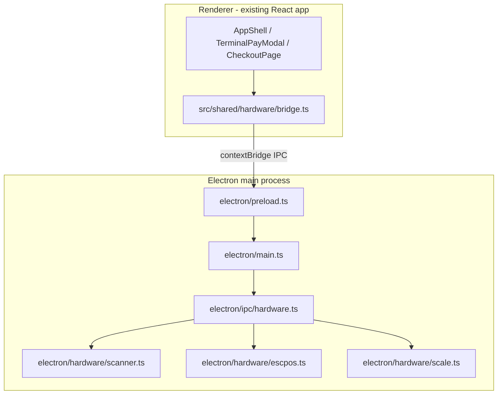

# Cheko Windows Desktop App — Build Plan

**Document version:** 2026-07-30  
**Audience:** Implementers building the Electron Windows POS  
**Related docs:** [FULL_STACK_WINDOWS_POS.md](./FULL_STACK_WINDOWS_POS.md) · [BACKEND_HANDOFF.md](./BACKEND_HANDOFF.md)

---

## Build environment strategy

| Where | What you build here |
|-------|---------------------|
| **macOS (primary dev)** | Electron shell, React UI, payment provider Settings, adapter layer, IPC stubs, cross-compile installer |
| **Windows PC (handoff)** | Real hardware (printer, drawer, scanner, scale), native module rebuild, installer smoke test, pilot QA |

### When to move to the Windows PC

Switch to the Windows machine when **all macOS checklist items below are done** and you are ready for **Step 8 — Windows hardware pilot**. Concretely, move when you need to verify any of these on real hardware:

1. **Silent ESC/POS receipt print** (no OS print dialog)
2. **Cash drawer kick** via printer RJ11
3. **USB barcode scanner** (keyboard wedge) at lane speed
4. **Weigh scale** on a COM port (`serialport` native module)
5. **`electron-rebuild`** for `serialport` / printer libs against your Electron version
6. **Install and run** `Cheko-POS-Setup-x64.exe` from a Windows build (prefer building on Windows for native deps)

Until then, keep building on Mac — Electron dev (`npm run dev:desktop`) runs fine on macOS with **stubbed hardware IPC**.

---

## Implementation checklist

Track progress here as you build:

- [x] **electron-scaffold** — `electron/` folder (main, preload, tsconfig), package.json scripts, Vite base for ELECTRON builds
- [x] **hardware-ipc** — `ipc/hardware.ts`, `escpos.ts`, `scanner.ts`, `scale.ts`
- [x] **renderer-bridge** — `src/shared/hardware/`, `useBarcodeScanner`, `barcode.ts` parser
- [x] **wire-payment-flow** — print/drawer in TerminalPayModal; scanner on checkout tab
- [x] **settings-desktop** — printer list, terminal ID, scale port in Settings
- [x] **payment-provider-settings** — PaymentProviderPanel, masked API keys, secure Electron IPC storage
- [x] **payment-adapter-layer** — `src/shared/payments/`, wire TerminalPayModal, SettlementModal, CashPoint
- [x] **windows-installer** — `electron-builder.yml`, `build:desktop` script
- [x] **env-docs** — update `.env.example`, add `docs/HARDWARE_PILOT.md` on Windows

---

## Current state

Cheko is a **UI-complete React 19 + Vite 6 SPA** with in-memory mocks and no desktop layer. Everything needed for Windows is documented in [FULL_STACK_WINDOWS_POS.md](./FULL_STACK_WINDOWS_POS.md) but **not implemented**:

- No `electron/` folder, no `electron-builder`, no desktop scripts in `package.json`
- `src/features/pos/terminal/api.ts` stubs throw `"Not implemented"` — including `printReceipt`
- `.env.example` has `VITE_HARDWARE_BRIDGE=electron` placeholders but nothing reads them
- `vite.config.ts` uses default `base: "/"` — must be `"./"` for packaged `file://` loading

**Backend note:** [FULL_STACK_WINDOWS_POS.md](./FULL_STACK_WINDOWS_POS.md) recommends Laravel; this project will use **Rails** for `cheko-api` in Phase 2. Phase 1 keeps mocks — hardware bridge and desktop shell first.

---

## Target architecture (Phase 1)



Renderer never touches hardware directly — all access goes through `window.chekoHardware` exposed in preload.

---

## Folder structure to add

```
cheko/
├── electron/
│   ├── main.ts                 # BrowserWindow, lifecycle, spawn IPC
│   ├── preload.ts              # contextBridge → window.chekoHardware
│   ├── tsconfig.json           # CommonJS emit for main/preload
│   ├── ipc/
│   │   ├── hardware.ts         # IPC handlers: print, drawer, scale, scan, config
│   │   └── config.ts           # Terminal env + payment credentials (secure)
│   └── hardware/
│       ├── escpos.ts           # electron-pos-printer + raw drawer pulse
│       ├── scanner.ts          # HID keyboard-wedge buffer (main process)
│       └── scale.ts            # Serial/COM weight reader (serialport)
├── src/
│   ├── shared/hardware/
│   │   ├── types.ts            # ChekoHardware, ReceiptPayload, TerminalConfig
│   │   └── bridge.ts           # isElectron(), delegates to window.chekoHardware or no-op
│   ├── shared/payments/        # Payment adapter layer (see §4)
│   ├── shared/utils/barcode.ts # GS1 weight label parser (supermarket prep)
│   ├── hooks/useBarcodeScanner.ts
│   └── vite-env.d.ts           # Window.chekoHardware global types
├── electron-builder.yml        # NSIS Windows x64 installer
└── package.json                # desktop scripts + deps
```

---

## Step 1 — Electron scaffold + dev workflow

**Dependencies (dev):** `electron@^33`, `electron-builder`, `concurrently`, `wait-on`

**Dependencies (runtime/hardware):**
- `electron-pos-printer` — receipt print + cash drawer kick
- `serialport` — weigh scale on COM port (Windows)

**Scripts to add to `package.json`:**

| Script | Purpose |
|--------|---------|
| `build:electron` | `tsc -p electron/tsconfig.json` |
| `dev:desktop` | Vite dev server + compile electron + launch Electron |
| `build:desktop` | `vite build` (base `./`) + `build:electron` + `electron-builder --win --x64` |

**`vite.config.ts` changes:**
- Set `base: process.env.ELECTRON === "true" ? "./" : "/"` so packaged app loads assets correctly
- Optional: disable HMR in desktop dev via existing `DISABLE_HMR` env

**`electron/main.ts`:**
- Create `BrowserWindow` with `contextIsolation: true`, `nodeIntegration: false`
- Dev: load `http://localhost:3000`
- Prod: load `dist/index.html` via `loadFile`
- Register IPC handlers from `ipc/hardware.ts`
- Production flags: `win.setMenu(null)`, optional `--kiosk` CLI arg for fullscreen POS

**`electron/preload.ts` — expose typed API:**

```typescript
interface ChekoHardware {
  printReceipt(payload: ReceiptPayload): Promise<{ ok: boolean }>;
  openCashDrawer(): Promise<void>;
  getScaleWeight(): Promise<{ kg: number; stable: boolean }>;
  listPrinters(): Promise<string[]>;
  getConfig(): Promise<TerminalConfig>;
  onScan(callback: (barcode: string) => void): () => void;
  getPaymentConfig(): Promise<PaymentConfigSummary>;
  savePaymentConfig(creds: PaymentProviderCredentials): Promise<void>;
}
```

Broadcast (`startBroadcast` / `stopBroadcast`) stays **stubbed** in Phase 1 — Python BLE sidecar is Phase 3.

---

## Step 2 — Hardware IPC layer

### Receipt printer + cash drawer — `electron/hardware/escpos.ts`

- Use `electron-pos-printer` to render 80mm HTML receipt template
- `openCashDrawer(printerName, { pin: 2 })` — **only on cash payment** (see FULL_STACK_WINDOWS_POS §5.3)
- `listPrinters()` for Settings UI
- Config: `CHEKO_PRINTER_NAME` from env / `electron/ipc/config.ts`

### Barcode scanner — `electron/hardware/scanner.ts`

- USB HID keyboard wedge: buffer keydown with inter-key delay < 30ms, terminate on Enter
- Renderer: `useBarcodeScanner` → lookup SKU via catalog → add to cart

### Weigh scale — `electron/hardware/scale.ts`

- Read `CHEKO_SCALE_PORT` (e.g. `COM3`) via `serialport`
- Return `{ kg, stable }` when reading settles

### Config — `electron/ipc/config.ts`

```env
CHEKO_TERMINAL_ID=POS-LAG-001
CHEKO_PRINTER_NAME=XP-80C
CHEKO_SCALE_PORT=COM3
```

Update `.env.example` with Vite renderer vars and Electron main vars.

---

## Step 3 — Renderer integration

| File | Change |
|------|--------|
| `src/shared/hardware/bridge.ts` | `isHardwareBridge()` checks `VITE_HARDWARE_BRIDGE === "electron"` |
| `src/features/pos/terminal/api.ts` | `printReceipt()` → call bridge |
| `src/features/pos/terminal/TerminalPayModal.tsx` | Print on success; drawer on cash tender |
| `src/app/AppShell.tsx` | Mount `useBarcodeScanner` on checkout tab |
| `src/features/settings/pages/SettingsPage.tsx` | Desktop hardware + Payment Provider panels |

**Cash sale sequence:**

```
Scan items → Charge → Cash → tender confirmed
  → openCashDrawer() → printReceipt() → onSuccess
```

**Bank transfer:** print only, no drawer.

---

## Step 4 — Payment provider settings (Settings UI)

Merchants choose their payment gateway in **Settings → Payment Provider**. Saved credentials unlock virtual account numbers, card/NFC charges, and transfer quick-verify.

**Only CheckoutNow supports all capabilities today.**

### Provider capability matrix

| Provider | Virtual account / NUBAN | Card / NFC charge | Transfer quick-verify | BLE broadcast pay |
|----------|-------------------------|-------------------|----------------------|-------------------|
| **CheckoutNow** | Yes | Yes | Yes | Yes |
| MevonPay | Yes | Yes | Yes | No |
| Paystack | Yes | Yes | Partial (webhook) | No |
| Moniepoint | Yes | Yes | Partial | No |
| Squad | Yes | Yes | Partial | No |

### Types — `src/types/payment-provider.ts`

```typescript
export type PaymentProviderId =
  | "checkoutnow"
  | "mevonpay"
  | "paystack"
  | "moniepoint"
  | "squad";

export interface PaymentProviderCapabilities {
  virtualAccount: boolean;
  cardCharge: boolean;
  transferVerify: boolean;
  broadcastPay: boolean;
}

export interface PaymentProviderCredentials {
  provider: PaymentProviderId;
  apiKey?: string;
  secretKey?: string;
  publicKey?: string;
  terminalId?: string;
  merchantId?: string;
  contractCode?: string;
  signingKey?: string;
  webhookSecret?: string;
  testMode?: boolean;
}
```

### Settings UI — `src/features/settings/components/PaymentProviderPanel.tsx`

- Provider cards with capability badges
- Masked credential fields per provider (manager PIN required to save)
- Test connection button
- Secure storage via Electron IPC (Windows Credential Manager target in production)

| Provider | Required fields |
|----------|-----------------|
| CheckoutNow | API key, Terminal ID, Signing key, Merchant ID |
| MevonPay | API key, Terminal ID |
| Paystack | Secret key, Public key |
| Moniepoint | API key, Merchant ID, Contract code |
| Squad | Secret key, Merchant ID |

### Payment adapter layer — `src/shared/payments/`

```
src/shared/payments/
├── types.ts
├── capabilities.ts
├── getActiveProvider.ts
├── adapter.ts
├── checkoutnow.ts        # Full implementation
├── paystack.ts
├── moniepoint.ts
├── squad.ts
├── mevonpay.ts
└── index.ts              # resolveAdapter(providerId)
```

Wire into: `TerminalPayModal`, `SettlementModal`, `OnlineOrdersPage`, Cash Point flows, and `PaymentProviderContext` in `src/app/providers.tsx`.

Phase 1: CheckoutNow adapter returns realistic mocks when keys are present; other providers stub until Rails proxies live calls.

---

## Step 5 — Windows installer

**`electron-builder.yml`:**
- Target: `nsis` x64
- Output: `dist/Cheko-POS-Setup-x64.exe`
- App ID: `com.checkoutnow.cheko`

**Rebuild native modules on Windows:** run `electron-rebuild` for `serialport` and printer libs.

---

## Step 6 — Full-stack roadmap (Rails — after Phase 1)

| Phase | Work |
|-------|------|
| **2 — Rails API** | `cheko-api`: auth, terminals, products, sales; encrypted `payment_providers` table; gateway proxy endpoints |
| **2 — Frontend fusion** | `src/shared/api/client.ts`; move payment calls to Rails; Settings syncs provider to backend |
| **3 — Broadcast** | Python sidecar on `127.0.0.1:8765`; Rails `POST /broadcast/verify` |
| **4 — Business modes** | Restaurant table map; supermarket PLU grid |
| **5 — Offline queue** | SQLite in Electron main for offline sales sync |

---

## Step 7 — Verify on macOS (before Windows handoff)

- [ ] `npm run dev:desktop` opens Electron with Cheko UI
- [ ] `window.chekoHardware` exists in DevTools
- [ ] Mock scan IPC adds product to cart
- [ ] `npm run build:desktop` produces installer artifact (cross-compile OK)
- [ ] Settings → Payment Provider: save keys, test connection passes
- [ ] TerminalPayModal hides unsupported methods for partial providers
- [ ] Bank transfer shows virtual account from adapter (not hardcoded NUBAN)

**When all above pass → move to Windows PC for Step 8.**

---

## Step 8 — Windows hardware pilot (on Windows PC)

- [ ] Clone repo, `npm install`, `electron-rebuild`
- [ ] Install `Cheko-POS-Setup-x64.exe` (or `npm run dev:desktop` on Windows)
- [ ] Silent receipt print — 100 receipts, no dialog
- [ ] Cash drawer opens **only** on cash payment
- [ ] EAN-13 scan at lane speed
- [ ] Scale stable weight ± 0.005 kg on COM port
- [ ] Document hardware models in `docs/HARDWARE_PILOT.md`

---

## Risks and mitigations

| Risk | Mitigation |
|------|------------|
| macOS cannot test ESC/POS / COM hardware | Stub IPC on Mac; real test on Windows PC |
| `serialport` native module mismatch | Pin versions; `electron-rebuild` on Windows |
| Vite `base` breaks web deploy | Gate `base: "./"` behind `ELECTRON=true` only |
| Star TSP100 drawer needs raw ESC/POS | Fallback raw pulse in `escpos.ts` |

---

## Key files to leverage

- `src/app/AppShell.tsx` — payment success, terminal modal
- `src/features/pos/terminal/TerminalPayModal.tsx` — payment phase machine
- `src/hooks/useCatalog.ts` — barcode product lookup
- `src/hooks/useCart.ts` — cart operations
- `src/features/settings/pages/SettingsPage.tsx` — add new panels here
